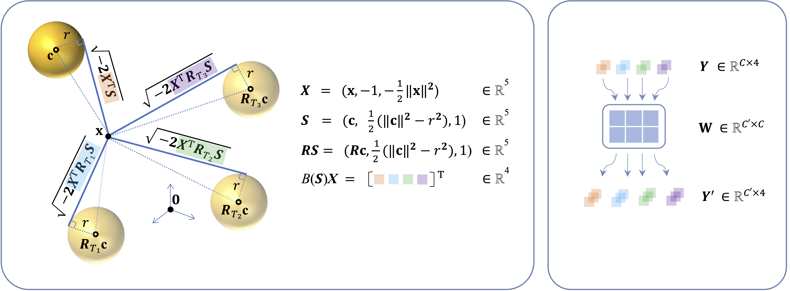

# TetraSphere: A Neural Descriptor for O(3)-Invariant Point Cloud Analysis

The official implementation of the ["TetraSphere: A Neural Descriptor for O(3)-Invariant Point Cloud Analysis"](https://arxiv.org/abs/2211.14456) paper, accepted at CVPR 2024

[[arXiv]](https://arxiv.org/abs/2211.14456) [[video]](https://www.youtube.com/watch?v=MRJr0V7eMj8&ab_channel=PavloO.Melnyk) [[bibtex]](https://github.com/pavlo-melnyk/tetrasphere#Citation)


## Teaser




## Requirements
To be able to run the code, install the dependencies by running the following:

```
conda create -n tetrasphere
conda deactivate
conda activate tetrasphere
conda install python=3.9
conda install pytorch torchvision cudatoolkit=11.3 -c pytorch
conda install h5py scikit-learn future tqdm wget
pip install tensorboardx pytorch_lightning torchmetrics datetime
```


## Datasets

Inspect `tetrasphere/config.py` to find the preset paths to the datasets, and edit if you like.

- The datasets can be downloaded with a convenience application:
    ```
    cd tetrasphere
    python download_datasets.py
    ```

If you want to download them manually, simply use the links below.

- ModelNet-40 can be downloaded [here](https://shapenet.cs.stanford.edu/media/modelnet40_ply_hdf5_2048.zip).

- To acquire the ScanObjectNN dataset, download the file h5_files.zip from [here](http://hkust-vgd.github.io/scanobjectnn/h5_files.zip). 
  (For reference, the download link was provided by the authors [here](https://github.com/hkust-vgd/scanobjectnn/issues/31).)

- To get the ShapeNet-Part you should register on the shapenet.org webpage. 
  However, as this dataset seems to be inaccessible through browsing the website, we found [this link](https://shapenet.cs.stanford.edu/media/shapenet_part_seg_hdf5_data.zip) in the GitHub repos of multiple authors working on point cloud segmentation.


## Run

To run the experiments, navigate to `tetrasphere/experiments/`.

- Point cloud classification:

  `python train_mn40.py` - ModelNet40

  `python train_objbg.py` - ScanObjectNN, `objbg` variant

  `python train_pbt50rs.py` - ScanObjectNN, `pb-t50-rs` variant

- Part segmentation:

  `python train_partseg.py`

- Pretrained weights for the four experiments are included in the `weights/` directory.
  To test these, run

  `python evaluate_all.py`
 

### Note

Due to the default usage of `float32` with `torch`, the pairwise distances in the point clouds might slightly (by up to $10^{-5}$) differ when the point cloud is rotated (especially in the case of the corrupted real data from `pb-t50-rs`).

Thus, the `knn` function as the part of the baseline (VN-)DGCNN *sometimes* returns different nearest neighbors for a rotated input, which technically breaks rotation-equivariance within the VN layers in the network.

Changing the precision to `float64` rectifies this in most cases.
However, since the original training was conducted with `float32`, *in rare cases* the accuracy of TetraSphere and the baseline may insignificantly vary depending on the input orientation (by up to $0.1\\%$ accuracy).

## Citation
Please cite if you find the code/paper useful:
```
@InProceedings{Melnyk_2024_CVPR,
    author    = {Melnyk, Pavlo and Robinson, Andreas and Felsberg, Michael and Wadenb\"ack, M\r{a}rten},
    title     = {TetraSphere: A Neural Descriptor for O(3)-Invariant Point Cloud Analysis},
    booktitle = {Proceedings of the IEEE/CVF Conference on Computer Vision and Pattern Recognition (CVPR)},
    month     = {June},
    year      = {2024},
    pages     = {5620-5630}
}
```


